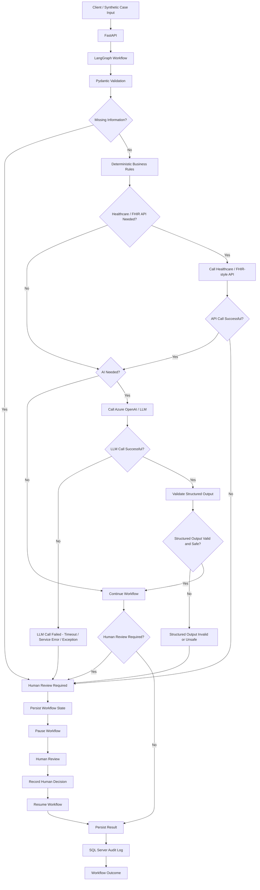

<!--
File Name: README.md
Purpose: Main project overview, Phase 1 scope, architecture summary, current status, setup guidance, limitations, and production roadmap.
Creation Date: 2026-09-13
Author: K.Kashiwagi
-->

# Healthcare AI Forward Deployment Lab

## 1. Purpose

This project demonstrates the end-to-end skill set of a healthcare Data
Forward Deployment Engineer (FDE): translating a business problem into
requirements, designing a solution architecture, implementing it, and
planning its path from prototype to production — applied to a
healthcare workflow support use case.

## 2. FDE Portfolio Objective

This project is intentionally built to demonstrate:

- Requirements gathering and translation
- Solution architecture
- Python development
- REST/API integration
- Healthcare/FHIR-style integration
- LLM workflows
- SQL
- Testing
- Human-in-the-loop review
- Auditability
- Documentation
- Client delivery thinking
- Prototype-to-production planning

## 3. Phase 1 Use Case

**Prior Authorization workflow support.** A synthetic prior
authorization case is validated, run through explicit business rules,
optionally assisted by an LLM for language-oriented sub-tasks, and
routed to human review when information is missing, uncertain, or
high-impact. See [docs/requirements.md](docs/requirements.md) for full
detail.

**This is not intended to be a production healthcare system.** Only
synthetic healthcare data is used. The AI does not independently make
clinical approval or denial decisions — see
[docs/security.md](docs/security.md).

## 4. Current Project Status

**IMPLEMENTED:**
- Pydantic prior-authorization case validation
- Deterministic completeness rules
- FastAPI case-validation endpoint (`POST /cases/validate`)
- LangGraph workflow foundation (explicit graph, nodes, and routing)
- Deterministic AI-routing rules
- Structured AI contract and provider flow (validated structured
  output, never a raw/untrusted LLM response)
- Azure OpenAI adapter and configuration
- Synthetic FHIR-style integration client
- Deterministic evidence-consistency rules
- SQL persistence and audit foundation (`workflow_runs`, `audit_events`
  tables via a repository pattern)
- Local Microsoft SQL Server persistence validation (connectivity,
  schema creation, and repository read/write round-trips against a
  real local instance)
- Alembic migration framework, operational and applied: Wave 1
  (14 organization/reference tables) and Wave 2 (8 case/workflow
  tables, including a canonical replacement of the `workflow_runs`/
  `audit_events` prototype) of the canonical database foundation have
  both been migrated onto the real local SQL Server database and
  validated (installed revision `b9aba5b07ac8`); the disposable
  synthetic prototype rows were intentionally removed as part of the
  Wave 2 controlled rebuild, and all 14 Wave 1 tables were preserved
  unchanged
- pytest test suite (279 tests passing as of this update)
- Architecture design artifacts (ADRs, architecture/security/
  requirements docs)

**DESIGNED / PLANNED (not yet implemented):**
- Remaining canonical Phase 1 relational data model (Wave 3 and later,
  14 of 36 tables remaining) — see [docs/database/](docs/database/)
- Reference/master seed data loading for the Wave 1/Wave 2 tables
- Wave 6 relational hardening (CHECK constraints, JSON validation,
  secondary indexes, composite FKs, `event_types` composite uniqueness,
  `workflow_runs` composite uniqueness)
- Runtime wiring of the Wave 2 architecture decisions: LangGraph/API →
  persistence, `trace_id` generation at the orchestration boundary, and
  the LangGraph-node-to-workflow-step mapping (all decided in
  [ADR-007](docs/decisions/ADR-007-trace-id-and-workflow-step-mapping.md),
  none implemented as running code yet)
- Human-in-the-Loop persistence/pause/resume (today the workflow only
  carries a `human_review_required` routing flag; there is no dedicated
  review-task table or reviewer-decision persistence yet)
- Streamlit application
- Remaining end-to-end and productionization work — see
  [docs/production_roadmap.md](docs/production_roadmap.md)

## 5. Planned Phase 1 Stack

| Layer | Technology |
|-------|-----------|
| Frontend | Streamlit |
| Backend | Python, FastAPI, Pydantic |
| Workflow | LangGraph |
| Database | Microsoft SQL Server (local), SQL |
| AI | Azure OpenAI / Azure AI Foundry, structured LLM output |
| Integration | REST/JSON, healthcare/FHIR-style API |
| Testing | pytest |
| Development | Git, GitHub, Claude Code |

These choices (LangGraph, SQL Server, Azure OpenAI/Foundry) have been
reviewed and are fixed for Phase 1 — see
[docs/decisions/](docs/decisions/).

## 6. High-Level Architecture

The system separates three kinds of information at every stage of a
case: **deterministic facts/rules**, **AI inference**, and **human
decisions** — never blended together. Explicit validation and business
rules run before any LLM call; the LLM is used only for
language-oriented sub-tasks, never for the final outcome; and anything
missing, uncertain, or high-impact routes to human review. Full detail:
[docs/architecture.md](docs/architecture.md).

## 7. High-Level Workflow

## 8. Security & Privacy Statement

- Only **synthetic** healthcare data is used — no real PHI/PII, ever.
- No secrets, credentials, or connection strings are hard-coded;
  configuration is supplied via environment variables and git-ignored
  local files (see [.env.example](.env.example)).
- The AI does not independently make clinical approval or denial
  decisions — see [docs/security.md](docs/security.md) for full policy.

## 9. Prototype vs. Production

This is a **portfolio prototype**, not a production healthcare system.
It does not include production-grade authentication/authorization,
managed secrets, real FHIR server integration, formal compliance
controls, or operational hardening. See
[docs/production_roadmap.md](docs/production_roadmap.md) for what
Phase 2 (production) would require.

## 10. Current Limitations

- No real external FHIR/payer system integration exists — the
  FHIR-style client uses synthetic data only, not a live production
  data source.
- Only 22 of the canonical 36-table Phase 1 database design (see
  [docs/database/](docs/database/)) are physically built (Waves 1-2);
  no persistence orchestration wires the LangGraph workflow or the API
  to any of these tables yet — the physical schema exists, but nothing
  in `src/` writes to it.
- Human-review outcomes are not yet persisted; only a routing flag
  exists today.
- No Streamlit UI exists yet.
- Not evaluated for clinical, legal, or regulatory accuracy — it is a
  technical/architectural demonstration only.

## 11. Phase 2 — Productionization (Summary)

Moving toward production would require, among other things: real
PHI/HIPAA-compliant data handling, authentication/authorization, a
managed secrets vault, real FHIR/payer integrations, production
observability, and formal AI governance. See
[docs/production_roadmap.md](docs/production_roadmap.md) for the full
summary.

## 12. Database Design Documentation

**IMPLEMENTED:**
- The Alembic migration framework (see
  [ADR-005](docs/decisions/ADR-005-database-schema-migration-strategy.md))
  is installed, initialized, and in active use — `alembic.ini` and
  `migrations/` (`env.py`, `script.py.mako`, `versions/`) exist in the
  repository.
- Wave 1 of the canonical database foundation — 14 organization and
  core reference tables (`reasons`, `countries`, `clients`,
  `locations`, `departments`, `case_statuses`, `workflow_statuses`,
  `workflow_actions`, `event_categories`, `event_types`,
  `actor_types`, `source_components`, `result_codes`,
  `failure_categories`) — has been migrated onto the real local SQL
  Server database `healthcare_ai_fde_lab` and validated: all primary
  keys, foreign keys, and business-key uniqueness constraints
  confirmed present.
- Wave 2 of the canonical database foundation — 8 case/workflow tables
  (`document_types`, `workflow_definitions`, `workflow_definition_steps`,
  `prior_authorization_cases`, `case_diagnoses`, `case_documents`, and
  the canonical `workflow_runs`/`audit_events`) — has also been
  migrated onto the real local SQL Server database and validated:
  installed Alembic revision `b9aba5b07ac8`, 8/8 primary keys, 40/40
  foreign keys, and 2/2 business-key uniqueness constraints confirmed
  present. `document_types` was originally scoped to Wave 3 but was
  pulled forward into Wave 2 because `case_documents.document_type_code`
  requires it (schema only — no reference rows were inserted).
- The canonical `workflow_runs`/`audit_events` tables (23/19 columns,
  accessed through `AuditRepository`) replaced the Task 18A/18B
  prototype shape via a controlled rebuild — the disposable synthetic
  prototype rows were intentionally removed, per
  [ADR-006](docs/decisions/ADR-006-first-revision-and-brownfield-strategy.md).
  All 14 Wave 1 tables were preserved, untouched, throughout.
- The `trace_id` generation point and the LangGraph-node-to-workflow-step
  mapping architecture decisions are resolved (see
  [ADR-007](docs/decisions/ADR-007-trace-id-and-workflow-step-mapping.md))
  — decided, but not yet wired into any running code.

**DESIGNED / PLANNED:**
- The remaining canonical Phase 1 relational data model (Wave 3 and
  later — 14 of 36 tables) covering deterministic rule evaluations,
  integration execution records, validated AI output, human review,
  and client requirement intake. This design has been reviewed and
  approved as the Phase 1 baseline but is implemented incrementally
  through Waves.
- Reference/master seed data loading for the Wave 1/Wave 2 tables.
- Runtime wiring of the ADR-007 decisions: an orchestration boundary
  that generates `trace_id` and calls the LangGraph graph, and the
  actual LangGraph-node-to-`workflow_definition_steps` mapping module
  — neither exists in `src/` yet.
- Wave 6 relational hardening (CHECK constraints, ISJSON validation,
  secondary indexes, composite FKs, the `event_types` composite-FK-support
  uniqueness constraint, and `workflow_runs` composite uniqueness) —
  deliberately deferred, not yet applied.

See:
- [docs/database/data_model.md](docs/database/data_model.md)
- [docs/database/data_dictionary.md](docs/database/data_dictionary.md)
- [docs/database/reference_data.md](docs/database/reference_data.md)
- [docs/database/constraints_and_indexes.md](docs/database/constraints_and_indexes.md)
- [docs/database/erd/](docs/database/erd/) — reviewed ERD artifacts (overview, full, and Mermaid text formats)
- [docs/database/migration_plan.md](docs/database/migration_plan.md) — Wave 0 migration plan and Wave 1/Wave 2 physical implementation status
- [docs/decisions/ADR-004-phase1-canonical-data-model.md](docs/decisions/ADR-004-phase1-canonical-data-model.md)
- [docs/decisions/ADR-005-database-schema-migration-strategy.md](docs/decisions/ADR-005-database-schema-migration-strategy.md) — schema migration mechanism decision

## 13. Documentation Index

- [docs/requirements.md](docs/requirements.md)
- [docs/architecture.md](docs/architecture.md)
- [docs/security.md](docs/security.md)
- [docs/production_roadmap.md](docs/production_roadmap.md)
- [docs/decisions/](docs/decisions/) — Architecture Decision Records
- [docs/database/](docs/database/) — Phase 1 canonical database design documentation
- [CLAUDE.md](CLAUDE.md) — guidance for Claude Code in this repo
