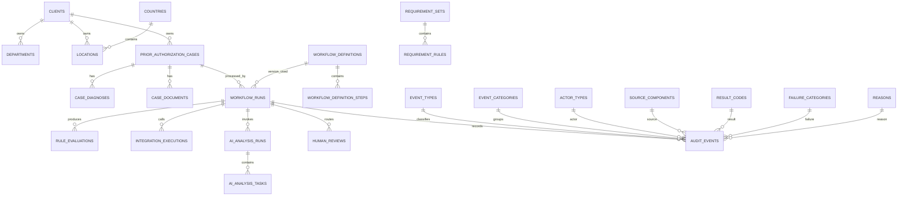

<!--
File Name: data_model.md
Purpose: Canonical Phase 1 relational data model, normalization principles, lifecycle rules, and implementation baseline
Creation Date: 2026-09-16
Author: K.Kashiwagi
-->

# Healthcare AI Forward Deployment Lab — Canonical Data Model v2.2

**Status:** DESIGN BASELINE — review/implementation planning.
**Database:** Microsoft SQL Server (Phase 1).
**Data policy:** Synthetic healthcare data only. No real PHI/PII.
**Use case:** Prior Authorization workflow support.

## 1. Purpose

This document explains **why the relational model is structured this way**.
Field-level definitions are maintained separately in [data_dictionary.md](data_dictionary.md); controlled seed/reference values are maintained in [reference_data.md](reference_data.md).

The model supports:

- Client Requirement Intake
- Prior Authorization case processing
- deterministic validation/business rules
- synthetic FHIR-style integration
- structured AI analysis
- Human-in-the-Loop review
- workflow state management
- immutable audit history
- traceability from business requirement to implementation/test/audit event

## 2. Core relational principles

1. **3NF-first** — normalize repeated facts and multi-valued attributes into relational child tables.
2. **Intentional denormalization only when documented** — audit queryability is the main exception.
3. **Facts ≠ deterministic results ≠ AI inference ≠ human decisions ≠ audit history.**
4. **Case lifecycle ≠ row deletion.**
5. **No cascade deletion of business or audit history.**
6. **Lowercase snake_case** for all table and field names.
7. **UTC timestamps** use `_at_utc`.
8. **Synthetic data only** for Phase 1.
9. **No secrets** in database business/configuration tables.
10. **`metadata_json` is controlled extension data, not an EAV substitute or garbage field.**

## 3. Table inventory

| table_name | category | purpose |
|---|---|---|
| `clients` | Master | Client/organization using the prior-authorization workflow. |
| `departments` | Master | Organizational department within a client. |
| `countries` | Reference Master | Country reference list used by locations and clients. |
| `locations` | Master | Client operating/processing location. |
| `case_statuses` | Reference Master | Controlled business lifecycle states for a case. |
| `reasons` | Reference Master | Controlled reasons for case close, logical delete, human review, audit correction, and other business events. |
| `workflow_definitions` | Master | Versioned workflow definition used to identify exactly which orchestration design processed a run. |
| `workflow_definition_steps` | Configuration Detail | Ordered steps belonging to a versioned workflow definition. |
| `workflow_statuses` | Reference Master | Controlled workflow-run states. |
| `workflow_actions` | Reference Master | Controlled next-step actions recommended or selected by the workflow. |
| `requirement_types` | Reference Master | Controlled categories of deterministic requirements/rules. |
| `requirement_sets` | Master | Versioned client-specific deterministic requirement set. |
| `document_types` | Reference Master | Controlled supporting-document types used by completeness checks. |
| `event_categories` | Reference Master | High-level audit-event categories. |
| `event_types` | Reference Master | Controlled audit-event types. |
| `actor_types` | Reference Master | Controlled types of actors that can initiate or perform actions. |
| `source_components` | Reference Master | Controlled system/component registry for internal Phase 1 components. |
| `result_codes` | Reference Master | Controlled result/outcome codes for technical/business processing events. |
| `failure_categories` | Reference Master | Controlled technical/business failure classifications. |
| `human_review_statuses` | Reference Master | Controlled lifecycle states for human-review tasks. |
| `human_review_outcomes` | Reference Master | Controlled non-autonomous human-review outcomes. |
| `discovery_item_types` | Reference Master | Controlled item types for Client Requirement Intake. |
| `ai_task_types` | Reference Master | Controlled AI task vocabulary used by structured AI analysis. |
| `client_requirement_intakes` | Transaction Header | Captured FDE/client discovery intake used by the Streamlit Client Requirement Intake area. |
| `client_requirement_items` | Transaction Detail | Individual stakeholder/requirement/risk/missing-information/acceptance-criterion items belonging to an intake. |
| `requirement_rules` | Configuration Detail | Atomic deterministic rule/requirement belonging to a requirement set. |
| `prior_authorization_cases` | Case Master / Transaction Header | Persistent case-level business record for the synthetic prior-authorization prototype. |
| `case_diagnoses` | Transaction Detail | Diagnosis-code rows associated with a case. |
| `case_documents` | Transaction Detail | Metadata/evidence reference for supporting documents associated with a case. |
| `workflow_runs` | Transaction Header | One execution of the workflow for a case; current state for that run. |
| `rule_evaluations` | Transaction Detail | Persisted deterministic validation/business-rule evaluation result. |
| `integration_executions` | Transaction Detail | Technical record of a healthcare/FHIR-style external integration execution without storing raw payloads. |
| `ai_analysis_runs` | Transaction Header/Detail | Validated AI-analysis execution metadata and structured synthetic output. |
| `ai_analysis_tasks` | Transaction Detail | One requested/completed AI task within an AI analysis run. |
| `human_reviews` | Transaction Header/Detail | Human-in-the-loop review task and outcome. AI never writes a clinical approval/denial decision. |
| `audit_events` | Append-only Audit History | Immutable, append-only audit record of significant events. Corrections are new events, never updates/deletes. |


## 4. Standard control-field policy

Every persistent table except `audit_events` contains all nine fields:

- `is_deleted`
- `created_at_utc`
- `created_by`
- `updated_at_utc`
- `updated_by`
- `deleted_at_utc`
- `deleted_by`
- `delete_reason_code`
- `delete_reason_text`

`audit_events` is the sole exception because it is append-only/immutable.

### Nullability rule for delete controls

Active row:

```text
is_deleted = 0
deleted_at_utc = NULL
deleted_by = NULL
delete_reason_code = NULL
delete_reason_text = NULL
```

Deleted row:

```text
is_deleted = 1
deleted_at_utc IS NOT NULL
deleted_by IS NOT NULL
delete_reason_code IS NOT NULL
delete_reason_text may be NULL
```

## 5. Case close vs. logical delete

Business closure:

```text
case_status_code = CLOSED
closed_at_utc IS NOT NULL
closed_by IS NOT NULL
close_reason_code IS NOT NULL
is_deleted = 0
```

Logical deletion is a separate data-lifecycle action and uses the standard delete-control fields.

## 6. Nullability design standard

`NULL Allowed = YES` does **not** mean "anything can be missing."

Nullability and lifecycle business rules are separate:

- PKs: NOT NULL
- required business fields: NOT NULL
- required FKs: NOT NULL
- optional relationships: NULL allowed
- Boolean flags: normally NOT NULL
- terminal timestamps/outcomes: NULL until lifecycle state requires them
- failure fields: NULL on successful/non-failure paths
- deleted/closed fields: conditional
- empty string is not used as a substitute for NULL

The authoritative field-by-field rule is in [data_dictionary.md](data_dictionary.md).

## 7. Normalization and intentional denormalization

### Normalized structures

- Case → many Workflow Runs
- Case → many Diagnoses
- Case → many Documents
- Workflow Definition → many Steps
- Requirement Set → many Requirement Rules
- AI Analysis Run → many AI Analysis Tasks
- Workflow Run → many Rule Evaluations
- Workflow Run → many Integration Executions
- Workflow Run → many Human Reviews
- Workflow Run → many Audit Events

### Intentional denormalization 1 — `audit_events.case_id`

Normalized path:

`audit_events.trace_id → workflow_runs.trace_id → workflow_runs.case_id`

`case_id` is retained directly on `audit_events` for case-level audit retrieval, filtering, indexing, and audit self-containment.

Preferred consistency control:

```text
UNIQUE workflow_runs(trace_id, case_id)
COMPOSITE FK audit_events(trace_id, case_id)
    → workflow_runs(trace_id, case_id)
```

### Intentional denormalization 2 — `audit_events.event_category_code`

Normalized path:

`audit_events.event_type_code → event_types.event_type_code → event_types.event_category_code`

Direct storage is retained for audit filtering/grouping.

Preferred consistency control:

```text
UNIQUE event_types(event_type_code, event_category_code)
COMPOSITE FK audit_events(event_type_code, event_category_code)
    → event_types(event_type_code, event_category_code)
```

## 8. Deterministic mismatch modeling

`EvidenceConsistencyResult.mismatch_reasons` can contain multiple reasons.

The relational design uses **one deterministic evaluation row per check/reason**, rather than storing a list in one scalar column.

Example:

```text
rule_evaluations
- SERVICE_CODE_MATCH      → SERVICE_CODE_MISMATCH
- DIAGNOSIS_CODE_MATCH    → DIAGNOSIS_CODE_MISMATCH
- DOCUMENT_PRESENT        → DOCUMENT_NOT_FOUND
```

This preserves first-class relational queryability.

## 9. Failure vs. business reason

These are separate semantics.

**Failure Category** = technical/workflow failure, for example:

- FHIR HTTP failure
- malformed/invalid integration output
- AI provider failure
- AI structured-output validation failure
- persistence failure

**Reason** = business/deterministic explanation, for example:

- service code mismatch
- diagnosis code mismatch
- required document not found
- case close reason
- human review reason
- delete reason

Evidence mismatch reasons must not be misclassified as system failures.

## 10. FHIR evidence persistence boundary

Raw/retrieved clinical FHIR evidence is **transient in Phase 1**.

Persist:

- integration execution status
- result/failure category
- timing
- safe counts/resource-type metadata
- deterministic comparison/evaluation result

Do not persist:

- raw FHIR payloads
- raw clinical narrative
- real PHI/PII
- full retrieved clinical evidence values solely for debugging

This is a deliberate **data minimization** decision.

## 11. AI persistence boundary

Phase 1 may persist **validated structured AI output** only after Pydantic validation.

Allowed:

- validated summary
- validated ambiguities
- validated inconsistencies
- validated clarifying questions
- safe execution metadata

Not allowed:

- raw prompt
- raw provider response
- API key
- endpoint secret
- connection string
- real PHI/PII

## 12. Workflow action vs. LangGraph node

Internal LangGraph node names are implementation details.

`workflow_actions` contains business-facing semantic actions such as:

- `CONTINUE_PROCESSING`
- `REQUEST_MISSING_INFORMATION`
- `ROUTE_HUMAN_REVIEW`
- `COMPLETE_WORKFLOW`

A deterministic translation layer maps graph execution state to the controlled business action. Internal node names are not persisted as business action codes.

## 13. Workflow versioning

Initial Phase 1 workflow baseline:

```text
workflow_code = PRIOR_AUTHORIZATION
version_no = 1.0
```

Each `workflow_runs` row references the exact `workflow_definition_id` used for processing.

## 14. Identifier strategy

Recommended Phase 1 strategy:

- entity/run/event IDs: application-generated UUID/string identifiers
- master/reference codes: human-readable stable business codes
- no database identity dependency required for orchestration identifiers

Examples:

- `case_id` → application-generated identifier
- `trace_id` → application-generated identifier
- `event_id` → application-generated identifier
- `case_status_code` → controlled business code
- `event_type_code` → controlled business code

## 15. ER overview



The simplified diagram above shows table relationships only, not every field. The full, reviewed ERD artifact set is committed under [erd/](erd/):

- [erd/phase1_relational_erd_overview.svg](erd/phase1_relational_erd_overview.svg) / [erd/phase1_relational_erd_overview.png](erd/phase1_relational_erd_overview.png) — relationship-oriented visual overview of all 36 tables
- [erd/phase1_relational_erd_full.svg](erd/phase1_relational_erd_full.svg) — detailed field-level/reference view (every column, type, nullability, and key)
- [erd/phase1_relational_erd_mermaid.md](erd/phase1_relational_erd_mermaid.md) — text-based relationship definition suitable for GitHub review/diffing

These artifacts represent the target Phase 1 design baseline, not the currently deployed SQL Server schema.

## 16. Implementation Waves

**Wave** = dependency-aware implementation batch.

- **Wave 0 — Migration Planning & Contract Preservation**
  Map existing `workflow_runs` / `audit_events`, preserve repository contract/tests, resolve ID strategy. No LangGraph-to-old-schema wiring is required.

- **Wave 1 — Organization, Lifecycle & Core Reference Foundation**
  Organization masters, workflow/audit vocabularies, seed data.

- **Wave 2 — Case & Workflow Schema Expansion**
  Cases, diagnoses, documents, workflow definitions/steps, target `workflow_runs`, target `audit_events`.

- **Wave 3 — Requirements & Deterministic Rules**
  Requirement sets/rules, document types, rule evaluations.

- **Wave 4 — Integration, AI & Human-in-the-Loop Persistence**
  Integration execution, AI run/tasks, human review.

- **Wave 5 — Client Requirement Intake**
  Intake headers/items and discovery types.

- **Wave 6 — Relational Hardening & End-to-End Validation**
  Composite FKs, uniqueness, CHECK constraints, indexes, seed validation, JSON validation, E2E tests.

## 17. Deferred production entities

Intentionally deferred:

- Member/Patient Master
- Provider Master
- Service Code Master
- Diagnosis Code Master
- External System Master
- User/Reviewer Master
- Audit Retention Policy Master
- Audit Access Policy Master

Deferral is deliberate to avoid unnecessary PHI/PII, terminology-governance, IAM, and compliance scope in Phase 1.

## 18. Repository-review resolutions incorporated in v2.2

1. Four missing field-level FK references were corrected in `data_dictionary.md`.
2. Workflow-run status vocabulary was reconciled:
   - canonical: `PROCESSING`, `HUMAN_REVIEW_REQUIRED`, `COMPLETED`, `FAILED`
   - current `COMPLETE` migrates to `COMPLETED`
   - current `AI_ANALYSIS_REQUIRED` / `AI_ANALYSIS_COMPLETE` become workflow step/event semantics, not run statuses
   - missing-information handling uses rule results, Case lifecycle, and `REQUEST_MISSING_INFORMATION`, not an `INCOMPLETE` workflow-run status
3. Lookup-driven lifecycle rules are enforced in application/service logic because SQL Server CHECK constraints cannot query status-master rows.
4. A same-row human-review completion/outcome CHECK is retained because it is locally enforceable.
5. Pydantic/API `max_length` validation must align with bounded SQL string columns before Wave 2 persistence wiring.
6. The initial generic `ERROR` event category was removed from seed data; failures remain in their functional event category and use `failure_category_code` for classification.

## 19. Related documentation

- [data_dictionary.md](data_dictionary.md) — authoritative field-level dictionary
- [reference_data.md](reference_data.md) — proposed controlled seed/reference-data catalog
- [constraints_and_indexes.md](constraints_and_indexes.md) — relational integrity, uniqueness, CHECK constraint, and index catalog
- [erd/](erd/) — reviewed ERD artifacts (overview, full, and Mermaid text formats)
- [../decisions/ADR-004-phase1-canonical-data-model.md](../decisions/ADR-004-phase1-canonical-data-model.md) — the architecture decision record for this model
- [../architecture.md](../architecture.md) — overall Phase 1 system architecture
