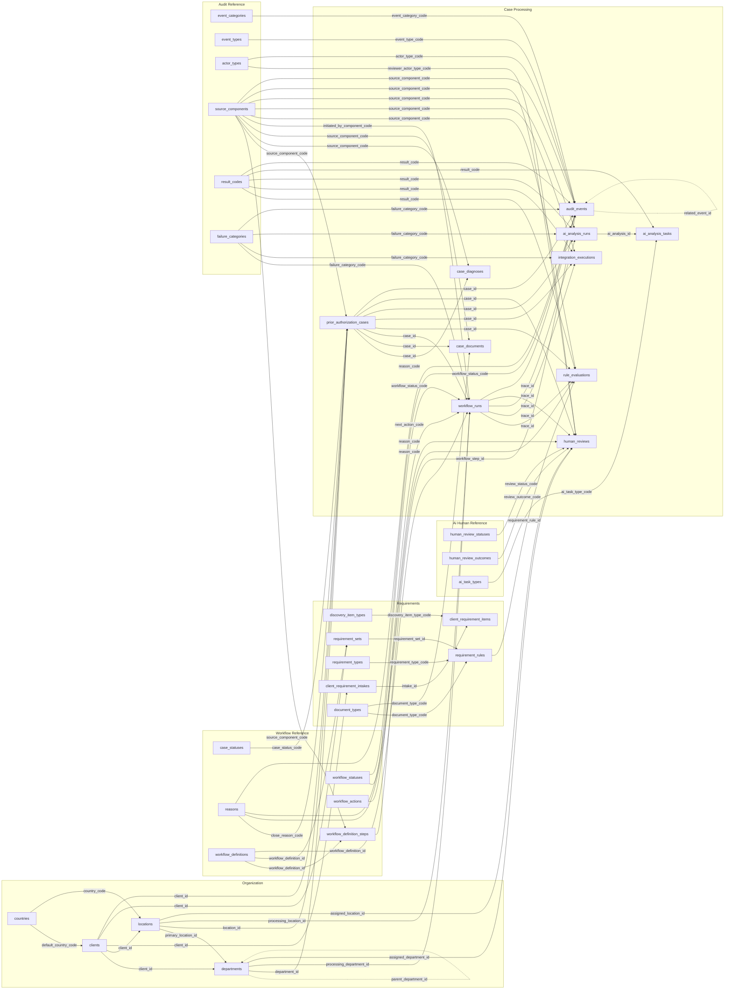

<!--
File Name: phase1_relational_erd_mermaid.md
Purpose: Phase 1 canonical relational database ERD and relationship reference
Creation Date: 2026-09-16
Author: K.Kashiwagi
-->

# Phase 1 Canonical Relational Database ERD

**Status:** DESIGN BASELINE — target Phase 1 relational model; not fully implemented.

> This is a relationship-focused ERD. [data_dictionary.md](../data_dictionary.md) is authoritative for field-level definitions; [constraints_and_indexes.md](../constraints_and_indexes.md) is authoritative for physical constraints, keys, and indexes. See [data_model.md](../data_model.md) for the full narrative design rationale.

## Control-field policy

Every persistent table except `audit_events` includes:

`is_deleted`, `created_at_utc`, `created_by`, `updated_at_utc`, `updated_by`, `deleted_at_utc`, `deleted_by`, `delete_reason_code`, `delete_reason_text`.

`audit_events` is append-only / immutable.

For readability, the universal `delete_reason_code -> reasons.reason_code` relationship is documented as a policy rather than drawing an edge from every non-audit table.

## Related documentation

- [data_model.md](../data_model.md) — canonical data model and normalization rationale
- [data_dictionary.md](../data_dictionary.md) — authoritative field-level dictionary
- [reference_data.md](../reference_data.md) — proposed controlled seed/reference-data catalog
- [constraints_and_indexes.md](../constraints_and_indexes.md) — authoritative relational integrity, uniqueness, CHECK constraint, and index catalog
- [phase1_relational_erd_overview.svg](phase1_relational_erd_overview.svg) — relationship-oriented visual overview
- [phase1_relational_erd_full.svg](phase1_relational_erd_full.svg) — detailed field-level/reference view
- [../../decisions/ADR-004-phase1-canonical-data-model.md](../../decisions/ADR-004-phase1-canonical-data-model.md) — the architecture decision record for this model
